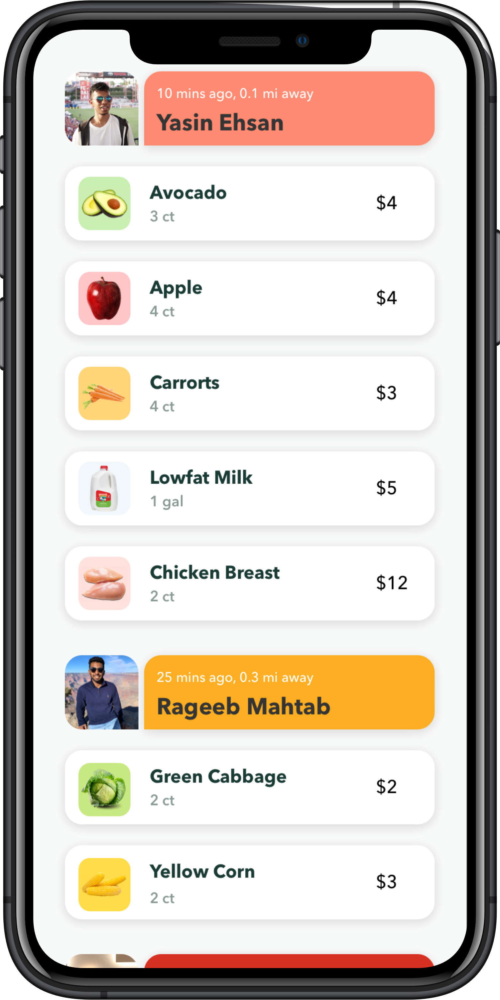
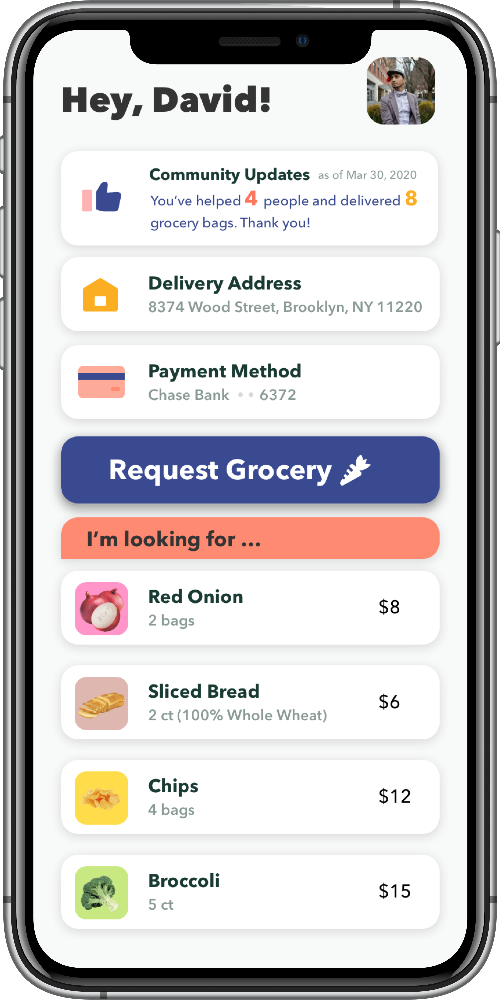
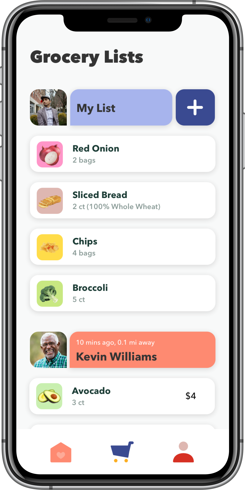
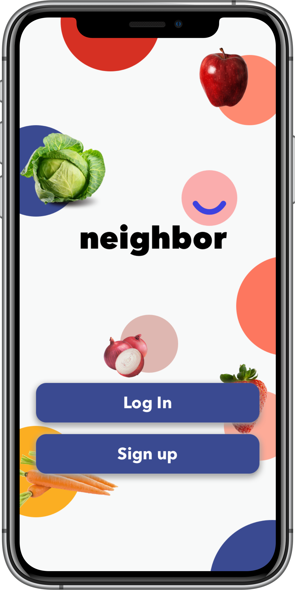

# Neighbor

**About:** A platform for users to post grocery items they need, and for neighbors to see the items requested by those near them, allowing them to buy and deliver the groceries in a seamless way. This enforces quarantine behavior, and helps build community growth

**Built With:** Swift, Xcode, Zeplin, Google Cloud, Firebase oAuth, Firebase Firestore, Stripe API, Google Analytics, MongoDB

**iOS Frameworks:** UIKit, MapKit, CoreLocation, FlyoverKit, UserNotifications, EventKit, Contacts, Firebase, Parse, Authentication, iCarousel, AlamoFire


## [Video Walkthrough]()
<div style="display: inline-block;">
  
  
  
  
</div><br/>

## Completed Stand-Ups / Milestones (2 hours sprints)
- [x] (Design) Wireframes
- [x] (Design) Zeplin components
- [x] (Native) Create boilerplate w rotating map
- [x] (Backend) Connect Google Authentication with Apple Account Plist
- [x] (Backend) Connect Google Firestore with Device
- [x] (Backend) Connect Database real time updates
- [x] (Native) Implement Apple Calnder and Apple Map transitions
- [x] (BackEnd) Connect Stripe API Sandbox account dummy account

## Roadblocks Overcame
- **Create Modular Code** Ever hate rewriting code? We used a singleton and MVC design patterns to write static objects and serialize and de-serialize objects between views on the phone and users in database.
```swift
/* global objects */
  static let sharedInstance = UserHub()
  static let db = Firestore.firestore()

/* serialize and de-serialize objects */
  struct Item: Codable {
    var price:String,  name: String, notes:String?

    enum CodingKeys: String, CodingKey {
           case price
           case name
           case notes
       }
}
```
- **Local Notifications Observers** Using them between View controllers we were able to write code in our singleton class and any changes made any other class would trigger local observers.
```Swift
/* triggered in singleton / model class */
    var shoppingList: [GroceryList] = [GroceryList]() {
        didSet {
            NotificationCenter.default.post(name: .shoppingList, object: self)
        }
    }

/* listeners in all view contollers */
    NotificationCenter.default.addObserver(forName: .vcOneAction, object: nil, queue: nil) { (notification) in
                self.items = self.user.requestedList
                self.itemTableView.reloadData()
            }

```
- **Global Database Observers**  We used realtime snapshots to listen to collections and sub-collections in real time feed. Most of the time in the hackathon was spent here.
```Swift
/* listen user changes ROOT COLLECTION*/
 FirebaseManager.db.collectionGroup("users").addSnapshotListener{ (querySnapshot, err) in

/* listen grocery list changes SUB COLLECTION*/
 let subCol = FirebaseManager.col_usersRef.document(id).collection("shoppingList").document("requestedItems")
```

## If we had more time
- [ ] (BackEnd) Connect real time payments on the app
- [ ] (BackEnd) Use MongoDB Atlas to store payment data (easy integ w Stripe)
- [ ] (Backend) Connect Google Storage to store profile images

## Useful Links
These were lifesaver tutorials...hopefully someone can find what we did but in less time.
- [Git ignore + storyboard merge conflict resolves](https://guides.codepath.com/ios/Using-Git-with-Terminal)
- [Pod merge conflict](https://medium.com/@amlcurran/how-to-deal-with-conflicts-in-pod-folders-2eb9fa20f465)
- [Integrating basic apple ios app](https://medium.com/appcoda-tutorials/integrating-basic-apple-pay-into-your-ios-app-71f17d48fc9b)
- [Computed properties in iOS](https://stackoverflow.com/questions/24006234/what-is-the-purpose-of-willset-and-didset-in-swift)
- [Six ways of passing data between view controllers](https://learnappmaking.com/pass-data-between-view-controllers-swift-how-to/)


## Team
- Backend: **Yasin Ehsan**, Queens College
- Native & Frontend: **Helal Chowdhury**, NYU
